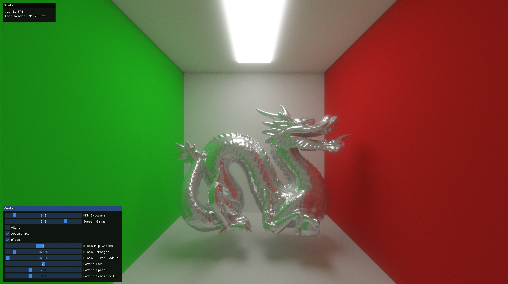
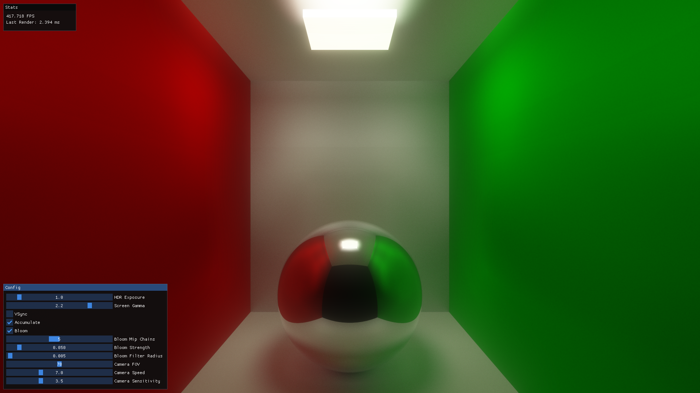

# Ray Tracing

A real-time GPU path tracer written in C++ and OpenGL. The renderer traces triangle meshes through a BVH, accumulates samples over time to converge to a noise-free image, and runs everything as a fragment shader pass on the GPU.

The scene is a Cornell box containing the Stanford dragon (around 100k triangles), lit by a single emissive quad on the ceiling.

## Preview

Current state:

Earlier version, before mesh support and the physically based material model:

## Features

- **Path tracing** of arbitrary triangle meshes, fully on the GPU
- **BVH acceleration structure** built with the Surface Area Heuristic (binned SAH), traversed on the GPU with a stackless-friendly iterative loop
- **PLY mesh loading** (the scene ships with the Stanford dragon)
- **Physically based shading**: metallic/roughness materials with a GGX microfacet specular lobe, cosine-weighted diffuse, and Fresnel-driven lobe selection
- **Emissive materials** as the only light source (no explicit light sampling, just brute-force path tracing)
- **Russian roulette** path termination
- **Progressive accumulation** across frames for convergence
- **Supersampling antialiasing** via sub-pixel ray jitter
- **Multi-pass render pipeline**: ray trace -> bloom -> tone map, with an optional BVH debug overlay
- **Physically based bloom** using a mip-chain downsample/upsample chain
- **Tone mapping** with adjustable HDR exposure and gamma
- **Free-fly camera** with runtime-adjustable speed, sensitivity, and FOV
- **ImGui panels** for live tweaking of render parameters and frame stats
- **Hot shader reload** at runtime

## How it works

The core path tracing logic lives in `Ray Tracing/shaders/raytracing.frag`. On the CPU side:

- The scene geometry is collected into a single mesh and a BVH is built over its triangles (`src/Renderer/RenderUtils/BVHBuilder.cpp`).
- Nodes, triangles, and materials are uploaded to the GPU as shader storage buffers (`src/Renderer/RenderUtils/GPUScene.cpp`).
- Each frame the fragment shader casts a camera ray per pixel, bounces it through the scene, and blends the result into an accumulation buffer.
- The accumulated image is post-processed by the bloom and tone map passes before being drawn to the screen.

The render passes are orchestrated by `src/Renderer/RenderPipeline.cpp`.

## Building

The project is a Visual Studio 2022 solution. All dependencies (GLFW, GLAD, GLM, Dear ImGui, spdlog) are vendored under `Ray Tracing/dependencies/`, so no external package setup is required.

1. Open `Ray Tracing.sln` in Visual Studio 2022.
2. Build and run.

## Controls

Movement:

| Key | Action |
| --- | --- |
| W / S | Forward / Backward |
| A / D | Left / Right |
| Q / E | Down / Up |
| Left Shift | Move faster |
| Right Mouse + Move | Look around |

Other:

| Key | Action |
| --- | --- |
| R | Reload shaders |
| B | Toggle BVH debug view |

Everything else (exposure, gamma, bloom, accumulation, camera speed and FOV) is adjustable at runtime from the Config panel.

## Resources

- https://raytracing.github.io/
- https://pbr-book.org/3ed-2018/contents
- https://www.scratchapixel.com/index.html
- https://www.youtube.com/watch?v=Qz0KTGYJtUk
- https://www.youtube.com/watch?v=C1H4zIiCOaI
- https://www.youtube.com/playlist?list=PLlrATfBNZ98edc5GshdBtREv5asFW3yXl

## Credits

Stanford Dragon model: ["Stanford Dragon (Vrip)"](https://skfb.ly/BSZn) by 3D graphics 101, licensed under [CC BY-NC 4.0](http://creativecommons.org/licenses/by-nc/4.0/).
